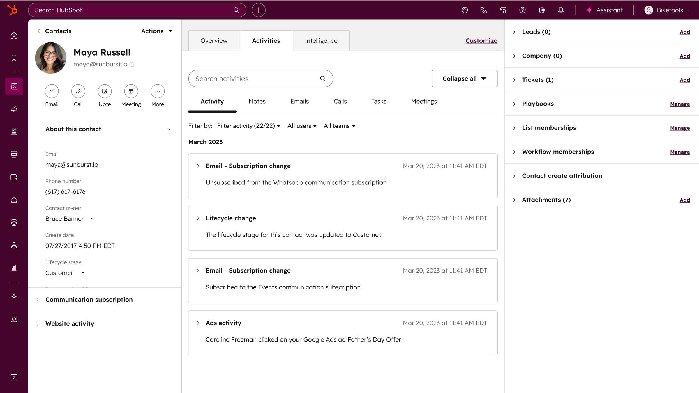
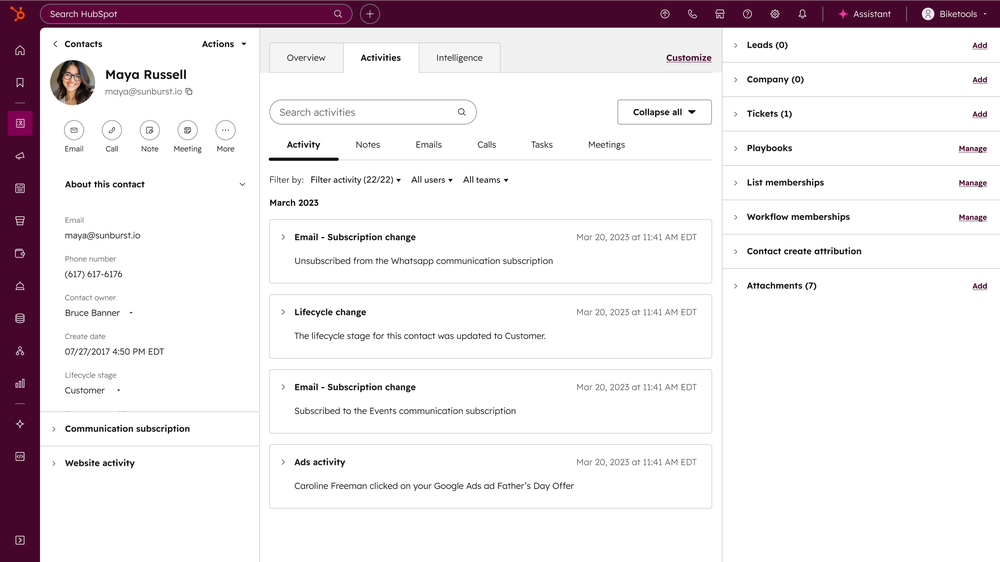
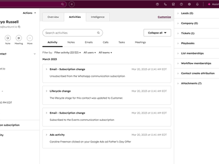
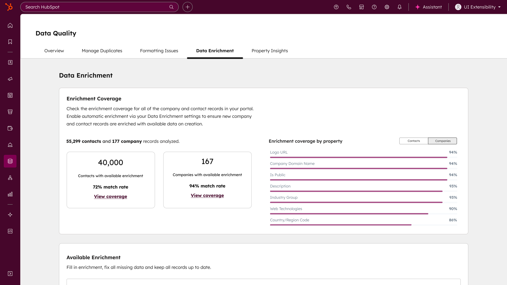
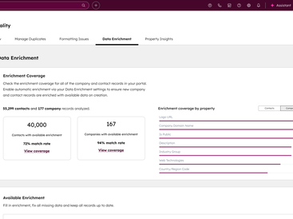

# HubSpot CRM

**Learn about HubSpot CRM.**

 

### 

[**Visit HubSpot CRM on SOFTGIT**](https://softgit.pro/p/hubspot-crm) · [Browse apps](https://softgit.pro)

---

## Overview

Learn about HubSpot CRM.

Learn about HubSpot CRM. Read HubSpot CRM reviews from real users, and view pricing and features of the CRM software

## At a glance

- Category: Business
- Publisher / site: the vendor
- Listing tag: Free trial
- Official site (from listing): https://sourceforge.net/software/product/HubSpot-CRM/
- Source listing: https://sourceforge.net/software/product/HubSpot-CRM/
- Type: Business / SaaS listing (information page)

## Screenshots

  
  
  
  
  
  

## System / listing information

| Field | Value |
|---|---|
| Name | HubSpot CRM |
| Category | Business |
| Publisher | the vendor |
| Platform | Any |
| License / offer | Free trial |
| Updated | October 5, 2026 |
| Listed package size | 1.1 MB |

## How to get started

1. Open the [HubSpot CRM page on SOFTGIT](https://softgit.pro/p/hubspot-crm).
2. Review the overview, screenshots, and any official website link on that page.
3. Use the page CTA to visit the vendor site or request access / trial as offered there.
4. This GitHub repo is an informational listing only — it does not host SaaS installers or account credentials.

[**Visit HubSpot CRM on SOFTGIT**](https://softgit.pro/p/hubspot-crm)

## FAQ

**What is this repository?**  
An unofficial information page for HubSpot CRM, with links to the [SOFTGIT listing](https://softgit.pro/p/hubspot-crm).

**Is software redistributed here?**  
No. SaaS products are used via the vendor’s website or apps. Do not treat any third-party zip on a listing as the product itself without verifying the source.

**Who owns this product?**  
Third-party software/service, all rights belong to the original authors and trademark owners. This repo is not affiliated with them.

---

[**Visit HubSpot CRM**](https://softgit.pro/p/hubspot-crm) · [SOFTGIT](https://softgit.pro)

Third-party software/service, all rights belong to the original authors. Unofficial listing for HubSpot CRM.

## More links

- 🌐 **[Visit HubSpot CRM on SOFTGIT](https://softgit.pro/p/hubspot-crm)** — the full listing.
- 📄 **[HubSpot CRM web page](https://bravebyteshroud15.github.io/hubspot-crm-download/)** — standalone info page.
- 🗂️ [More Business software](https://softgit.pro/category/business)
- 🏠 [SOFTGIT home](https://softgit.pro) · [All apps](https://softgit.pro/apps)
- 🔒 [Verify a download (SHA-256)](https://softgit.pro/security)

> Unofficial listing for HubSpot CRM. Third-party software; all rights belong to the original authors.
